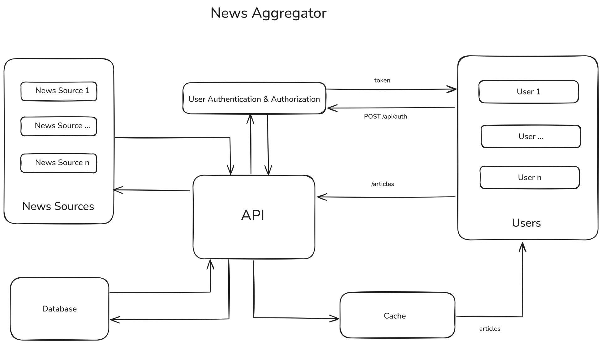

# News Aggregator Application
This repository contains Laravel 12 application, which provides news aggregator api. The application consumes these news articles from several sources and the same is available thorough the API.

## Application architecture


The above image describes the overall application architecture

## Tech Stack

* Laravel 12
* LaravelShift Blueprint (For initial scaffolding)
* Laravel Sanctum
* Laravel Octane (Frankenphp application runner)
* SQLite
* Redis

## Build and run application
### Build application
To build the application you need to have Podman/Docker installed in your system. From the terminal type below command if you have podman installed
```
podman build \
    -f container/Dockerfile \
    -t ghcr.io/adarshahd/aggregator:latest \
    .
```

For Docker use the command below
```
docker build \
    -f container/Dockerfile \
    -t ghcr.io/adarshahd/aggregator:latest \
    .
```
### Run application
For running application it is important to refer the .env file into the container. For podman use below command
```
podman run \
    -p 8000:8000 \
    -v ./.env:/var/www/html/.env:Z \
    ghcr.io/adarshahd/aggregator:latest
```
For docker use below command
```
docker run \
    -p 8000:8000 \
    -v ./.env:/var/www/html/.env \
    ghcr.io/adarshahd/aggregator:latest
```
